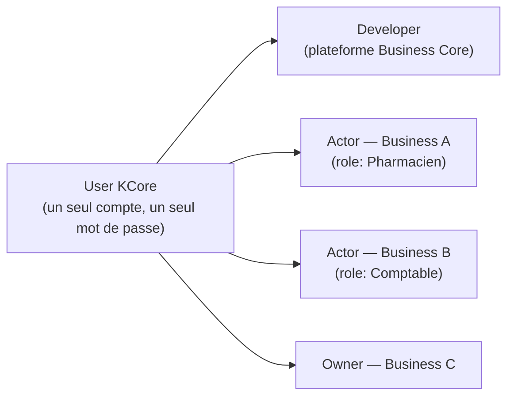
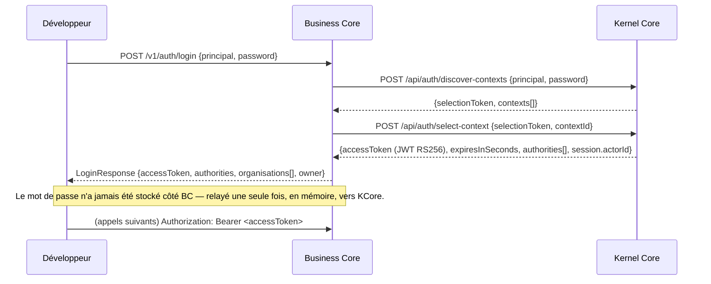
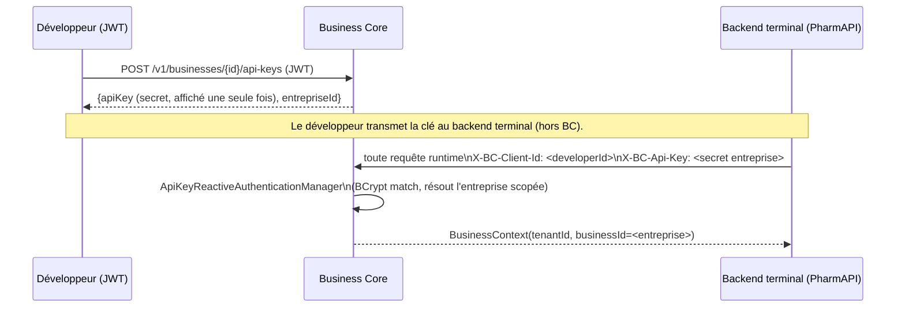
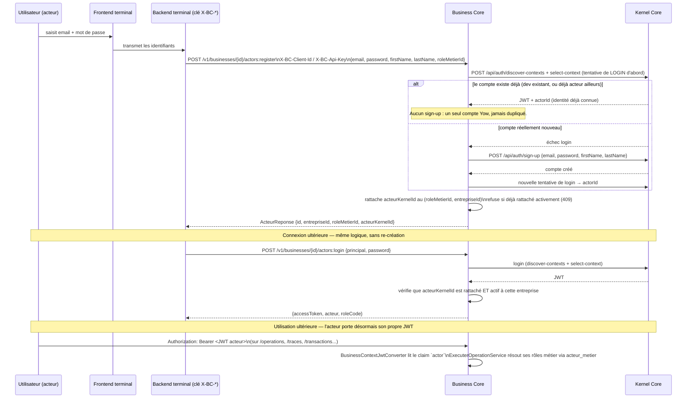

# Authentification — trois flux distincts

> Rapport de conception. Décrit les trois façons dont un acteur (humain ou machine) s'authentifie
> auprès de Business Core (BC), et comment BC délègue systématiquement la vérification d'identité au
> Kernel Core (KCore/YowAuth) sans jamais stocker de mot de passe localement.

## 0. Principe fondateur

Un compte Yow est **unique** et vit exclusivement dans KCore. Business Core ne le duplique jamais : il
consulte KCore pour savoir *qui parle*, puis résout localement *ce que cette identité peut faire dans
tel Business*.

```
KCore répond à « Qui es-tu ? »
Business Core répond à « Que peux-tu faire dans ce Business ? »
```

Une seule identité KCore peut porter plusieurs casquettes simultanément, sans jamais créer de second
compte :



Trois flux d'authentification en découlent, chacun avec sa propre porte d'entrée dans Business Core :

| # | Qui | Entre par | Porte quoi | Contexte produit |
|---|---|---|---|---|
| 1 | Développeur (humain) | `POST /v1/auth/login` → `Authorization: Bearer` | Gestion de la plateforme | `BusinessContext(tenantId, businessId=null)` |
| 2 | Backend terminal (machine, ex. PharmAPI) | `X-BC-Client-Id` + `X-BC-Api-Key` | Usage runtime d'**une** entreprise précise | `BusinessContext(tenantId, businessId=<entreprise>)` |
| 3 | Acteur métier (humain, ex. pharmacien) | `Authorization: Bearer` (JWT acteur) | Contexte métier (rôle) dans une entreprise | `BusinessContext(tenantId, actorId=<claim JWT>)` |

Les trois flux partagent le même mécanisme de fond (délégation à KCore, aucun mot de passe stocké) mais
répondent à des questions différentes et ont des surfaces d'API strictement séparées.

---

## 1. Flux développeur — JWT délégué

### Qui et pourquoi

Le développeur est l'opérateur de la plateforme : il crée des entreprises, déclare des types métier, des
rôles, des opérations, des règles, gère ses clés API. Il **n'est pas responsable de créer les comptes des
futurs utilisateurs** de son application terminale — ce rôle appartient au flux 3.

### Mécanisme



- Implémentation : `AuthentificationService` (délègue à `AuthentifierUtilisateur`/`KernelAuthAdapter`,
  qui pilote les deux appels `discover-contexts` + `select-context`, en mode « app-only » — c'est-à-dire
  avec l'identité de l'application Business Core elle-même, `X-Client-Id`/`X-Api-Key`, pas encore de
  Bearer utilisateur).
- À chaque login, `synchroniserTenant()` aligne `kernel_tenant_id`/`kernel_user_id` dans
  `developer_account` (table locale, **sans mot de passe**, uniquement des identifiants).
- Le JWT retourné est ensuite décodé par `BusinessContextJwtConverter` sur chaque requête protégée : les
  claims `tid` (tenant), `actor` (identité kernel de l'opérateur), `permissions` (autorisations
  techniques) construisent le `BusinessContext`. `businessId` reste toujours `null` pour ce flux — un
  développeur agit sur son tenant entier, pas sur une entreprise en particulier.
- `GET /v1/auth/me` expose le `developerId` stable (l'identifiant local, invariant, à utiliser comme
  `X-BC-Client-Id` dans le flux 2).

### Surface

Toutes les routes de gestion de plateforme : `/v1/business-types/**`, `/v1/businesses` (CRUD),
`/v1/businesses/{id}/api-keys*`, `/v1/businesses/{id}/actors` (CRUD, hors `:register`/`:login`),
`/v1/businesses/{id}/rules`, `/v1/dashboard`, `/v1/auth/me`. JWT strictement obligatoire — ces routes
n'acceptent jamais `X-BC-*` (`SecurityConfig`, classe `CONSOLE_JWT` dans `AuthRouteClassifier`).

---

## 2. Flux backend terminal — clé API scopée à une entreprise

### Qui et pourquoi

Un backend terminal (ex. PharmAPI) est une **machine**, pas un humain : il agit au nom d'**une**
entreprise précise pour consommer l'API runtime (opérations, traces, transactions, synchronisation). Il
n'a pas de mot de passe personnel — juste une clé émise par le développeur propriétaire de l'entreprise.

### Mécanisme



- `X-BC-Client-Id` = le `developerId` **stable** (jamais lié à une clé précise, exposé par
  `GET /v1/auth/me`) — identifie le compte développeur propriétaire.
- `X-BC-Api-Key` = le secret **de l'entreprise ciblée**. Contrainte forte : **une seule clé `ACTIVE`
  par entreprise à la fois** (index unique partiel en base, `uq_api_key_entreprise_active`) — créer une
  nouvelle clé exige de révoquer l'ancienne au préalable.
- `ApiKeyReactiveAuthenticationManager` confronte le secret aux hachés BCrypt des clés actives du
  développeur, résout l'entreprise associée, et construit un `BusinessContext` avec `businessId` **non
  nul** — c'est ce champ qui distingue structurellement ce flux du flux 1 (JWT) partout ailleurs dans le
  code (`ctx.businessId() != null` ⇔ authentifié par clé API).
- `BusinessContext.verifierAcces(businessId)` empêche qu'une clé scopée à l'entreprise A touche les
  données de l'entreprise B, même au sein du même tenant.

### Surface

`/v1/sync`, `/v1/businesses/me`, `/v1/businesses/{id}/operations*`, `/v1/businesses/{id}/traces*`,
`/v1/businesses/{id}/transactions*`, `/v1/businesses/{id}/orders*`, et
`/v1/businesses/{id}/actors:login` / `:register` (flux 3, cf. §3 — routées ici pour l'authentification
uniquement, la logique métier est distincte). Le Bearer JWT développeur reste accepté en alternative sur
ces routes (sauf `:login`/`:register`, cf. §3) — c'est la classe `API_INTEGRATION` dans
`AuthRouteClassifier`, à ne pas confondre avec `API_CLE_SEULE`.

---

## 3. Flux acteur métier — identité KCore, contexte Business Core

### Qui et pourquoi

Un acteur (pharmacien, caissier, comptable...) est un **utilisateur final humain** de l'application
terminale. Ce n'est ni un développeur, ni une machine : il a son propre compte Yow (email + mot de
passe), qu'il crée ou réutilise lui-même. Le développeur n'a plus vocation à créer ces comptes une fois
le Business publié.

### Modèle conceptuel

L'entité `ActeurMetier` (table `acteur_metier`) ne représente **pas** une identité : c'est un
**rattachement**.

```
ActeurMetier = (User KCore) + (Business) + (Rôle métier)
```

Contrainte d'unicité en base (`uq_acteur_metier_entreprise_actif`, index partiel) :
`(entreprise_id, acteur_kernel_id)` sur les lignes actives — **pas** `acteur_kernel_id` seul. Un même
utilisateur KCore peut donc être acteur actif dans N entreprises simultanément, avec un rôle différent
dans chacune, sans jamais dupliquer son identité.

### Mécanisme — inscription/connexion



Points clés :

- **Aucune identité KCore n'est jamais devinée à partir d'un email par Business Core.** La seule voie de
  résolution est : tenter une connexion réelle avec les identifiants fournis ; ne créer un compte que si
  cette connexion échoue. C'est un principe de conception délibéré (« Kernel Core est la source de
  vérité de l'identité, Business Core ne doit pas essayer de deviner »), pas une optimisation.
- `:register` et `:login` **n'acceptent que la clé API business** (`X-BC-Client-Id` +
  `X-BC-Api-Key`) — le JWT développeur y est explicitement refusé (403 applicatif si présenté à la
  place). Raison : un seul mode d'appel identifie sans ambiguïté quel backend terminal déclenche
  l'opération pour quel acteur ; accepter indistinctement JWT ou clé aurait ouvert une ambiguïté sur
  « qui » demande l'inscription/connexion d'un tiers.
- `GET /v1/businesses/{id}/actors/me` (JWT acteur uniquement, symétrique de `/v1/auth/me` côté
  développeur) permet à un backend terminal de résoudre le rôle courant de l'acteur porteur du JWT sans
  repasser par le kernel.
- `POST /v1/businesses/{id}/actors` (le rattachement piloté par le développeur, JWT) a été
  **volontairement restreint** : il n'essaie plus de résoudre ni créer une identité kernel à partir d'un
  identifiant texte. Il exige désormais un `acteurKernelId` déjà connu. Une personne inconnue de
  Business Core doit s'inscrire elle-même via `:register`.

### Surface

`/v1/businesses/{id}/actors:register`, `/v1/businesses/{id}/actors:login` — classe `API_CLE_SEULE`
(clé uniquement, jamais de cadenas `bearerAuth` dans la doc Swagger, headers `X-BC-*` marqués requis).
`/v1/businesses/{id}/actors/me` — JWT uniquement (classe par défaut `CONSOLE_JWT`, aucun header `X-BC-*`
documenté).

---

## 4. Le blocage kernel sur `actors:register` — deux incohérences distinctes, l'une corrigée, l'autre pas

En testant `actors:register` de bout en bout contre le vrai kernel, deux problèmes se sont succédé.
Le premier est corrigé côté Business Core ; le second est une incohérence côté kernel, à remonter.

### 4.1. Premier blocage (corrigé) — `client_credentials` jamais supporté par `/oauth2/token`

`appliquerRoleTechnique`/`rattacherAOrganisation` (appelés par `actors:register`) passent par
`KernelClient`, qui a deux modes : **délégué** (re-transmet le JWT de l'utilisateur courant) et
**machine** (pour les appels sans JWT à déléguer — le cas de `:register`/`:login`, qui n'en portent
jamais par construction, cf. §3). Le mode machine échangeait jusqu'ici les credentials du tenant contre
un token via :

```
POST /oauth2/token
Authorization: Basic base64(clientId:secret)
grant_type=client_credentials
```

Erreur obtenue : `400 Unsupported grant_type`. La documentation interne déjà rédigée par l'équipe kernel
(`docs/Guide_Special_Auth.md`, §4) est explicite : « Le seul `grant_type` supporté est le
token-exchange » (`urn:ietf:params:oauth:grant-type:token-exchange`, RFC 8693) — `client_credentials`
n'a **jamais** été exposé sur cet endpoint. Ce `400` était donc un refus correct du kernel, pas une
anomalie de sa part.

**Correction appliquée** : plutôt que d'implémenter le grant token-exchange (RFC 8693, qui suppose un
`subject_token` de départ — donc un mécanisme entièrement différent, pas juste un paramètre), on a
vérifié le contrat OpenAPI exact des endpoints appelés en mode machine (`docs/kernel1-api.json`) :

```
GLOBAL SECURITY: [
  {ClientId: [], ApiKey: []},                    ← alternative 1 : app seule, sans Bearer
  {ClientId: [], ApiKey: [], BearerAuth: []}      ← alternative 2 : app + Bearer
]
```

Le Bearer y est **additif, jamais obligatoire**. Le mode machine de `KernelClient` a donc été réécrit
pour envoyer uniquement `X-Client-Id`/`X-Api-Key` (aucun `Authorization`), sans passer par
`/oauth2/token` du tout — cf. `KernelClient.exchangeMachine`. Testé et confirmé : ce changement fait
disparaître entièrement le blocage `/oauth2/token`, l'appel atteint bien `/api/roles` côté kernel.
162 tests verts après ce changement (dont `KernelClientDelegationTest`, qui vérifie explicitement
qu'aucun `Authorization` n'est envoyé en mode machine et qu'aucun appel `/oauth2/token` n'est déclenché).

### 4.2. Second blocage (non corrigé, côté kernel) — lecture autorisée, écriture refusée sur `/api/roles`

Une fois le premier blocage levé, l'appel réel donne :

```
502 — Kernel HTTP 500 : Erreur serveur : Access Denied sur /api/roles
```

Précision importante sur la nature de l'erreur : c'est un **500**, pas un 401/403 — côté kernel, ça
ressemble à une exception d'autorisation non interceptée proprement plutôt qu'un refus contrôlé.

En isolant la séquence d'appels d'`AppliquerRoleTechniqueKernelAdapter.resoudreOuCreerRole` :

1. `GET /api/roles` (recherche du rôle par code) — **aucune erreur loguée**, cet appel aboutit avec les
   mêmes credentials app-only.
2. `POST /api/roles` (création du rôle, faute de le trouver) — **échoue** avec `Access Denied`.

Donc, sur ce même endpoint et avec les mêmes credentials `X-Client-Id`/`X-Api-Key` : **la lecture est
acceptée, l'écriture est refusée.** C'est précisément l'incohérence à documenter : le contrat OpenAPI
déclare `{ClientId, ApiKey}` comme suffisant pour `POST /api/roles` (aucune distinction de sécurité
entre `GET` et `POST` dans le spec, cf. §précédent — mêmes alternatives globales pour les deux méthodes),
mais l'implémentation réelle du kernel exige davantage pour l'écriture, sans que ce soit reflété dans le
spec ni retourné comme un refus d'autorisation propre (403 attendu, 500 obtenu).

### Statut et recommandation

- Le correctif du §4.1 est conservé : il est strictement meilleur que l'existant (conforme au contrat
  déclaré, plus simple qu'un token-exchange RFC 8693 non trivial à implémenter) et déplace le point de
  blocage plus loin dans la chaîne — il ne peut pas faire de mal, et lève définitivement la dépendance à
  `client_credentials`.
- Le blocage du §4.2 dépasse le périmètre de Business Core : c'est une question à trancher côté kernel
  (soit le spec est incomplet — `POST /api/roles` doit documenter un Bearer requis —, soit
  l'implémentation a un bug d'autorisation/gestion d'erreur sur cette route). Les deux éléments
  reproductibles pour le remonter : la requête exacte (`X-Client-Id`/`X-Api-Key` seuls, `POST /api/roles`
  avec `{code, name}`) et le contraste GET-accepté/POST-refusé sur le même endpoint, avec les mêmes
  credentials, dans le même appel.

---

## 5. Récapitulatif comparatif

| | Flux 1 — Développeur | Flux 2 — Backend terminal | Flux 3 — Acteur métier |
|---|---|---|---|
| Porteur | Humain (opérateur plateforme) | Machine (backend d'une entreprise) | Humain (utilisateur final) |
| Entrée | `Authorization: Bearer` (JWT) | `X-BC-Client-Id` + `X-BC-Api-Key` | `:register`/`:login` → clé API ; ensuite JWT propre |
| Émission d'identité | KCore, via `/v1/auth/login` | Business Core (clé locale, hachée BCrypt) | KCore, via `:register`/`:login` (façade BC) |
| Mot de passe stocké dans BC | Jamais | N/A (secret de clé API, haché) | Jamais |
| `BusinessContext.businessId` | `null` (tenant entier) | Entreprise résolue par la clé | `null` (résolu à la volée via `acteur_metier`) |
| `BusinessContext.actorId` | claim JWT `actor` (optionnel) | assertion optionnelle (`X-BC-On-Behalf-Of`) | claim JWT `actor` (l'acteur lui-même) |
| Peut créer une identité KCore ? | N/A (déjà authentifié) | Non | Oui, en dernier recours (sign-up si login échoue) |
| Surface | Gestion plateforme (`CONSOLE_JWT`) | Runtime entreprise (`API_INTEGRATION`) | Auth acteur (`API_CLE_SEULE`) + runtime via JWT propre |

---

## 6. État de vérification

- 162 tests automatisés verts (build propre), couvrant les trois flux et leurs cas d'erreur (acteur non
  rattaché, doublon de rattachement, rôle incompatible, absence de claim acteur, etc.), y compris le
  mode machine app-only du §4.1 (`KernelClientDelegationTest` : aucun `Authorization` envoyé, aucun
  appel `/oauth2/token`).
- Flux 1 et 2 vérifiés de bout en bout contre un kernel réel dans une session antérieure.
- Flux 3 vérifié de bout en bout contre un kernel réel jusqu'au point décrit en §4.2 : la résolution
  d'identité (login-first/sign-up-fallback) et le routage Business Core ↔ kernel fonctionnent
  intégralement ; le blocage restant (`POST /api/roles` → `Access Denied`) est côté kernel, hors du
  périmètre de la logique métier acteur.
