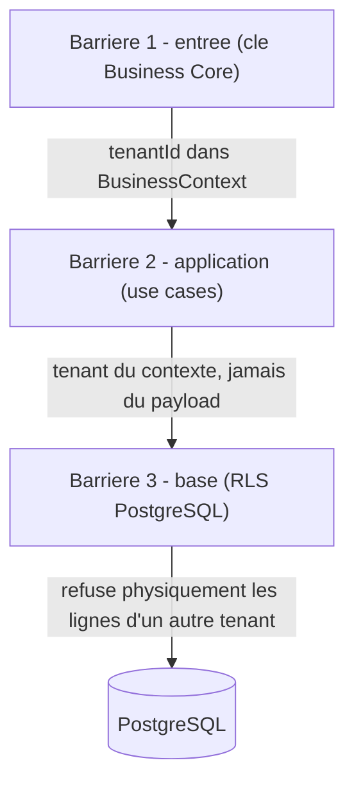

# Sécurité — défense en profondeur

La sécurité n'est pas qu'un filtre à l'entrée : chaque couche se protège elle-même, indépendamment des
autres. Si une couche laisse passer une erreur, la suivante la rattrape. Le socle fournit l'ossature ;
chaque feature respecte la checklist de sécurité.

## Définition du tenant

Le **tenant = le développeur**, identifié par `tenant_id = clientApplicationId` (propriétaire des Types
Métier). C'est la frontière d'isolation **dure**. Les données rattachées à une entreprise portent aussi
`business_id` : l'accès inter-entreprises au sein d'un même développeur relève de l'**autorisation**
(relationnel, dynamique), pas de l'isolation RLS.

## Isolation multi-tenant — trois barrières

1. **Entrée** — JWT Bearer et/ou clé BC (`X-BC-Client-Id` / `X-BC-Api-Key`) construisent le
   `BusinessContext` (avec `tenantId`) propagé dans le `Context` Reactor. Pas de tenant → 401.
2. **Application** — les use cases lisent le tenant **du `BusinessContext`, jamais du payload client** ;
   tout `id` reçu est revérifié comme appartenant au tenant courant (`TenantGuard`).
3. **Base** — **PostgreSQL Row-Level Security**, via un rôle applicatif **non-owner** (`bc_app`) :
   - `ENABLE` **et** `FORCE ROW LEVEL SECURITY` (le propriétaire lui-même est soumis) ;
   - policy `USING` **et** `WITH CHECK` (bloque aussi un INSERT cross-tenant) ;
   - prédicat `tenant_id = NULLIF(current_setting('app.current_tenant', true), '')::uuid` →
     **fail closed** (aucune ligne visible) si le contexte tenant n'est pas posé ;
   - le pool R2DBC pose `app.current_tenant` à l'allocation de connexion depuis le `BusinessContext` et
     le réinitialise au release (pas de bleed entre requêtes).

Pourquoi les deux derniers niveaux ensemble : la couche applicative protège même si RLS est mal
configuré ; RLS protège même si une requête brute contourne la couche applicative. Une fuite devrait
traverser deux protections indépendantes.

## Authentification

Trois flux distincts, détaillés avec schémas dans
[`authentification-trois-flux.md`](authentification-trois-flux.md) :

- **Développeur → Business Core** : JWT Bearer (login kernel délégué), obligatoire sur les routes de
  gestion de plateforme — jamais remplaçable par une clé BC sur ces routes-là.
- **Backend terminal → Business Core** : clé BC (`X-BC-Client-Id` / `X-BC-Api-Key`, hachée BCrypt,
  révocation, suivi d'usage), scopée à **une** entreprise. Utilisable **seule** (sans JWT) sur les routes
  runtime (`/v1/sync`, opérations, traces, transactions) ; le Bearer y reste une alternative acceptée.
- **Acteur métier → Business Core** : identité KCore propre (email/mot de passe, jamais stockés côté BC),
  résolue via `:register`/`:login` (qui exigent la clé BC de l'entreprise, **refusent** le Bearer
  développeur — un seul mode d'appel, sans ambiguïté), puis JWT acteur sur les appels suivants.
- **Business Core → kernel** : `X-Client-Id`/`X-Api-Key` de l'application BC sur chaque appel, plus
  `Authorization: Bearer` **quand une requête en porte un à déléguer** ; sinon repli app-only
  (`X-Client-Id`/`X-Api-Key` seuls, sans Bearer — le contrat OpenAPI du kernel l'accepte sur les
  endpoints concernés).

## Autorisation et identité de l'acteur

Authentifié ≠ autorisé. Deux mécanismes coexistent pour identifier l'opérateur agissant :
- **Assertion** (`X-BC-On-Behalf-Of`, modèle de confiance côté clé BC) — le backend terminal affirme
  qui agit, sans preuve cryptographique.
- **Authentification réelle** (flux acteur, JWT KCore propre à l'acteur) — Business Core résout le rôle
  métier de l'acteur via `acteur_metier`, sans faire confiance à une simple assertion.

`ExecuterOperationService`/`ResoudreRolesMetier` vérifient le rôle métier requis avant une action
sensible ; l'effet `DEROGER` est limité aux rôles autorisés. Le mécanisme RFC 8693 (OAuth Token
Exchange) évoqué comme évolution future reste pertinent, mais pour un usage différent de celui prévu
initialement : pas pour authentifier l'acteur (résolu), mais pour les appels Business Core → kernel en
mode machine sur les endpoints qui exigeraient une preuve d'autorité au-delà de `X-Client-Id`/`X-Api-Key`
(cf. `authentification-trois-flux.md` §4).

## Autres volets

- **Validation des entrées** : Bean Validation (`@Valid`) sur tous les DTO → 400 RFC 7807.
- **Secrets** : clés via variables d'environnement / vault, jamais en dur ni en base claire ; jamais
  de secret/JWT dans les logs. Cible prod : Spring Cloud Vault.
- **Transport / en-têtes / CORS** : HTTPS en prod ; en-têtes de sécurité et CORS stricts centralisés.
- **Rate limiting** : quotas natifs du kernel par ClientApplication (primaire) ; garde-fou token bucket
  Redis par tenant (secondaire, post-MVP).
- **Traçabilité** : échecs d'auth/autorisation et usages sensibles journalisés via `JournaliserAudit`.

## Erreurs (RFC 7807)

Toute erreur ressort en `application/problem+json`. `ProblemException` porte les extensions métier
`violatedRule`, `requiredAction`, `requiredDocument` (sémantique des effets de règle). Les 401/403 hors
controller sont aussi formatés en problem+json.

## Checklist sécurité par PR

- [ ] Mes tables portent `tenant_id` ; mes requêtes le filtrent (et la policy RLS est posée).
- [ ] Mes use cases lisent le tenant du `BusinessContext`, pas du payload.
- [ ] Je revérifie tout `id` reçu comme appartenant au tenant courant.
- [ ] Mes DTO sont validés (`@Valid`).
- [ ] Aucun secret ni JWT dans les logs.
- [ ] Les actions sensibles vérifient le rôle métier et tracent les refus.
