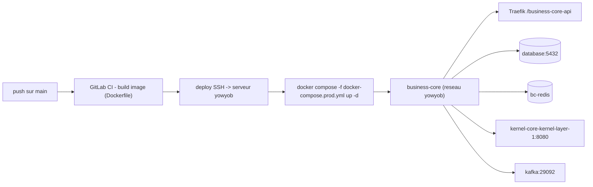

# Déploiement sur l'infrastructure yowyob

Le Business Core se déploie sur le serveur yowyob via **GitLab CI** : un push sur `main` construit
l'image sur le serveur (runner local, sans registry) puis la (re)déploie par SSH. Les fichiers de
déploiement sont à la **racine du dépôt** : [`Dockerfile`](../../Dockerfile),
[`docker-compose.prod.yml`](../../docker-compose.prod.yml), [`.gitlab-ci.yml`](../../.gitlab-ci.yml).

## Schéma

## Réseau yowyob (services partagés)

Le service rejoint le réseau Docker **externe** `yowyob` et adresse les dépendances par leur nom interne :

| Dépendance | Hôte interne | Notes |
|---|---|---|
| PostgreSQL | `database:5432` | base + user **dédiés** `businesscore` (à demander à l'admin) |
| kernel-core | `kernel-core-kernel-layer-1:8080` | pas l'URL publique `kernel-core.yowyob.com` |
| Kafka | `kafka:29092` | SASL_PLAINTEXT / SCRAM-SHA-256, user dédié |
| Redis | `bc-redis` | conteneur **dédié** au Business Core (défini dans le compose) |
| Traefik | — | exposition TLS, routage par chemin `/business-core-api` |

## Authentification kernel

Le kernel exige `X-Client-Id` + `X-Api-Key` (ClientApplication) sur chaque `/api/**`, plus
`Authorization: Bearer` sur les endpoints protégés, et `X-Organization-Id` pour les opérations
d'entreprise. Le socle gère cela dans `KernelClient`. Deux niveaux d'identité :

- **ClientApplication plateforme** du Business Core (`KERNEL_CLIENT_ID` / `KERNEL_CLIENT_SECRET`) :
  sert à provisionner les clients des développeurs (`POST /api/client-applications`).
- **ClientApplication par développeur** : provisionnée à l'inscription, stockée chiffrée, utilisée
  par `KernelClient` pour agir au nom du développeur.

## Variables d'environnement (`.env` sur le serveur)

Déposé **manuellement** dans `${DEPLOY_DIR}` (jamais commité ; lu via `env_file`) :

| Variable | Rôle |
|---|---|
| `APP_IMAGE` | injectée par le CI (`business-core/backend:<branche>_<sha>`) |
| `DB_PASSWORD` | mot de passe du user PostgreSQL dédié |
| `KERNEL_CLIENT_ID` / `KERNEL_CLIENT_SECRET` | ClientApplication plateforme |
| `BC_ENCRYPTION_KEY` | clé AES-256-GCM (chiffrement des secrets kernel) |
| `KAFKA_PASSWORD` | si Kafka SASL activé |

Variables CI GitLab (groupe) : `SSH_KEY`, `HOST_ADDR` (173.212.216.20), `HOST_USER` (gi) ; runner tag `kernel-core`.

## Isolation tenant en prod

Un seul user PostgreSQL dédié (`businesscore`) est propriétaire de sa base. La RLS reste effective
car les policies utilisent `FORCE ROW LEVEL SECURITY` (le propriétaire non-superuser y est soumis) et
le pool R2DBC pose `app.current_tenant` par connexion. Voir
[sécurité — défense en profondeur](architecture/securite-defense-profondeur.md).

## Santé et exposition

- Health check : `GET /actuator/health` (utilisé par le `healthcheck` du compose).
- Derrière Traefik, l'app est servie sous `https://business-core.yowyob.com/business-core-api`
  (stripprefix + `server.forward-headers-strategy=framework`).

## Local vs prod

| | Local (`docker-compose.yml`) | Prod (`docker-compose.prod.yml`) |
|---|---|---|
| Infra | conteneurs PG/Redis/Kafka dédiés | réseau `yowyob` partagé |
| Kernel | mock WireMock / `localhost` | `kernel-core-kernel-layer-1:8080` |
| Profil | `dev` | `prod` (config de base + env) |
| Kafka | PLAINTEXT | SASL_PLAINTEXT / SCRAM |
