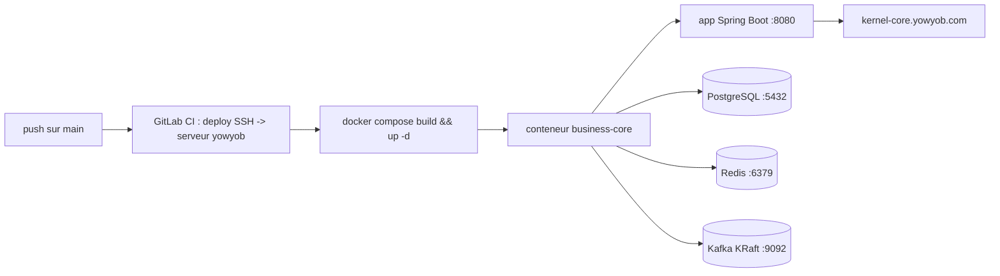

# Déploiement sur l'infrastructure yowyob

Le Business Core se déploie comme une image **all-in-one** : l'application Spring Boot,
PostgreSQL, Redis et Kafka (KRaft) tournent tous dans le **même conteneur**, supervisés par
supervisord. Un push sur `main` recopie les sources sur le serveur puis relance le conteneur
via **GitLab CI** + SSH. Les fichiers de déploiement sont à la **racine du dépôt** :
[`Dockerfile`](../../Dockerfile), [`docker-compose.yml`](../../docker-compose.yml),
[`.gitlab-ci.yml`](../../.gitlab-ci.yml), [`.env.example`](../../.env.example).

## Schéma

## Contenu du conteneur

Un seul `docker-compose.yml`, un seul service `business-core` :

| Composant | Rôle | Port (interne au conteneur) |
|---|---|---|
| App Spring Boot | API business-core | 8080 (exposé sur l'hôte via `APP_PORT`) |
| PostgreSQL 16 | Persistance (R2DBC + Liquibase/JDBC) | 5432 |
| Redis | Cache | 6379 |
| Kafka (KRaft, sans Zookeeper) | Bus d'événements | 9092 |

Les données de chaque composant sont persistées via des volumes Docker nommés
(`bc-pgdata`, `bc-kafkadata`, `bc-redisdata`), déclarés dans `docker-compose.yml`.

## Authentification kernel

Le kernel exige `X-Client-Id` + `X-Api-Key` (ClientApplication) sur chaque `/api/**`, plus
`Authorization: Bearer` sur les endpoints protégés, et `X-Organization-Id` pour les opérations
d'entreprise. Le socle gère cela dans `KernelClient`. Deux niveaux d'identité :

- **ClientApplication plateforme** du Business Core (`KERNEL_CLIENT_ID` / `KERNEL_CLIENT_SECRET`) :
  sert à provisionner les clients des développeurs (`POST /api/client-applications`).
- **ClientApplication par développeur** : provisionnée à l'inscription, stockée chiffrée, utilisée
  par `KernelClient` pour agir au nom du développeur.

## Variables d'environnement (`.env` sur le serveur)

Copier [`.env.example`](../../.env.example) en `.env` et renseigner (déposé **manuellement**
dans `${DEPLOY_DIR}`, jamais commité, lu via `env_file` par `docker-compose.yml`) :

| Variable | Rôle |
|---|---|
| `BC_DB_OWNER_PASSWORD` / `BC_DB_APP_PASSWORD` | mots de passe des rôles PostgreSQL internes au conteneur |
| `KERNEL_CLIENT_ID` / `KERNEL_CLIENT_SECRET` | ClientApplication plateforme |
| `BC_ENCRYPTION_KEY` | clé AES-256-GCM (chiffrement des secrets kernel) |
| `BC_ADMIN_EMAILS` | emails avec accès console admin |
| `APP_PORT` | port exposé sur l'hôte (défaut `8080`) |

Variables CI GitLab (groupe) : `SSH_KEY`, `HOST_ADDR` (173.212.216.20), `HOST_USER` (gi) ; runner tag `kernel-core`.

## Isolation tenant en prod

PostgreSQL tourne dans le même conteneur avec deux rôles dédiés : `bc_owner` (migrations
Liquibase) et `bc_app` (runtime R2DBC, non-owner, soumis à la RLS). La RLS reste effective car
les policies utilisent `FORCE ROW LEVEL SECURITY` et le pool R2DBC pose `app.current_tenant` par
connexion. Voir [sécurité — défense en profondeur](architecture/securite-defense-profondeur.md).

## Santé et exposition

- Health check : `GET /actuator/health`, utilisé par le `HEALTHCHECK` du Dockerfile et le
  `healthcheck` du compose.
- Derrière Traefik (ou reverse proxy équivalent), l'app est servie sous
  `https://business-core.yowyob.com` (`server.forward-headers-strategy=framework`).
